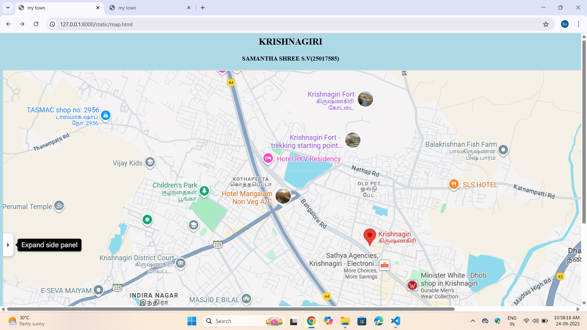
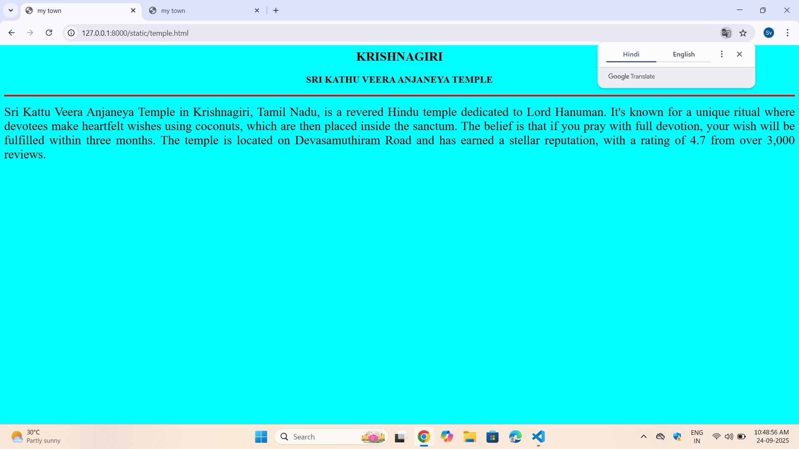
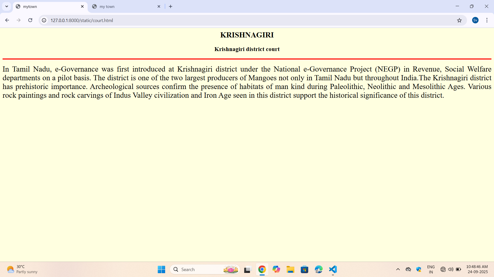
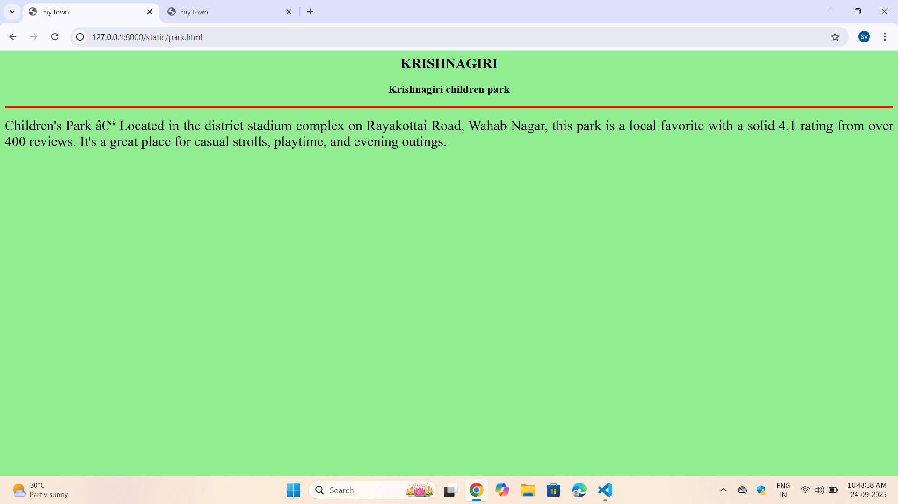
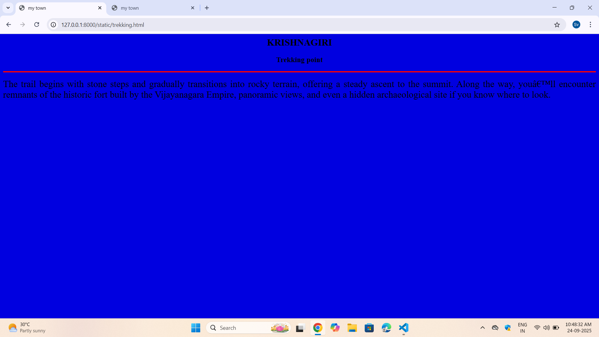
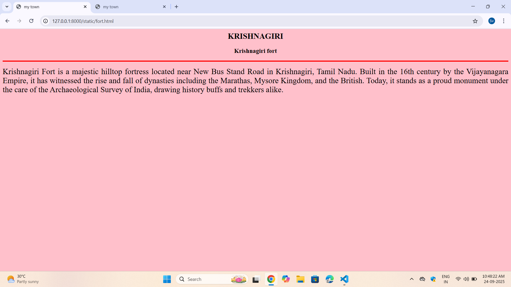

# Ex04 Places Around Me
## Date: 24.09.2025

## AIM
To develop a website to display details about the places around my house.

## DESIGN STEPS

### STEP 1
Create a Django admin interface.

### STEP 2
Download your city map from Google.

### STEP 3
Using ```<map>``` tag name the map.

### STEP 4
Create clickable regions in the image using ```<area>``` tag.

### STEP 5
Write HTML programs for all the regions identified.

### STEP 6
Execute the programs and publish them.

## CODE
```
map.html
<html>
    <head>
       <title>my town</title> 
    </head>
    <body bgcolor="lightblue">
    
        <h2 align="center">KRISHNAGIRI</h2>
        <h4 align="center">SAMANTHA SHREE S.V(25017585)</h4>
    

    

<map name="image-map">
    <area target="" alt="temple.html" title="temple.html" href="temple.html" coords="878,810,1043,893" shape="rect">
    <area target="" alt="park.html" title="park.html" href="park.html" coords="526,318,79" shape="circle">
    <area target="" alt="trekking.html" title="trekking.html" href="trekking.html" coords="867,153,955,153,916,237,904,230,884,226,880,225" shape="poly">
    <area target="" alt="fort.html" title="fort.html" href="fort.html" coords="947,70,65" shape="circle">
    <area target="" alt="court.html" title="court.html" href="court.html" coords="465,506,50" shape="circle">
</map>
    </body>
</html>

park.html
<html>
    <head>
        <title>my town</title>
    </head>
    <body bgcolor="lightgreen">
        <h2 align="center">KRISHNAGIRI</h2>
        <h3 align="center">
            <font>Krishnagiri children park</font>
        </h3>
     <hr size="3" color="red">
     <p align="justify">
        <font size="5">
             Children's Park – Located in the district stadium complex on Rayakottai Road,
             Wahab Nagar, this park is a local favorite with a solid 4.1 rating from over 400
             reviews. It's a great place for casual strolls, playtime, and evening outings.
        </font>
     </p>
    </body>
</html>

fort.html
<html>
    <head>
        <title>my town</title>
    </head>
    <body bgcolor="pink">
        <h2 align="center">KRISHNAGIRI</h2>
        <h3 align="center">
            <font> Krishnagiri fort</font>
        </h3>
     <hr size="3" color="red">
     <p align="justify">
        <font size="5">
             Krishnagiri Fort is a majestic hilltop fortress located near New Bus Stand Road in
            Krishnagiri, Tamil Nadu. Built in the 16th century by the Vijayanagara Empire, it has
            witnessed the rise and fall of dynasties including the Marathas, Mysore Kingdom, and
            the British. Today, it stands as a proud monument under the care of the
            Archaeological Survey of India, drawing history buffs and trekkers alike. 
        </font>
        </p>
        </body>
        </html>

trekking.html
<html>
    <head>
        <title>my town</title>
    </head>
    <body bgcolor="lightpurple">
        <h2 align="center">KRISHNAGIRI</h2>
        <h3 align="center">
            <font>Trekking point</font>
        </h3>
     <hr size="3" color="red">
     <p align="justify">
        <font size="5">
            The trail begins with stone steps and gradually transitions into rocky terrain,
            offering a steady ascent to the summit. Along the way, you’ll encounter remnants of
            the historic fort built by the Vijayanagara Empire, panoramic views, and even a
            hidden archaeological site if you know where to look.
        </font>
     </p>
    </body>
</html>

temple.html
<html>
    <head>
        <title>my town</title>
    </head>
    <body bgcolor="cyan">
        <h2 align="center">KRISHNAGIRI</h2>
        <h3 align="center">
            <font>SRI KATHU VEERA ANJANEYA TEMPLE</font>
        </h3>
     <hr size="3" color="red">
     <p align="justify">
        <font size="5">
          Sri Kattu Veera Anjaneya Temple in Krishnagiri, Tamil Nadu, is a revered Hindu temple dedicated to Lord Hanuman.
           It's known for a unique ritual where devotees make heartfelt wishes using coconuts, which are then placed inside
           the sanctum. The belief is that if you pray with full devotion, your wish will be fulfilled within three months.
           The temple is located on Devasamuthiram Road and has earned a stellar reputation, with a rating of 4.7 from over 3,000 reviews.

        </font>
     </p>
    </body>
</html>

court.html
<html>
    <head>
        <title>mytown</title>
    </head>
    <body bgcolor="lightyellow">
        <h2 align="center">KRISHNAGIRI</h2>
        <h3 align="center">
            <font>Krishnagiri district court</font>
        </h3>
     <hr size="3" color="red">
     <p align="justify">
        <font size="5">
            In Tamil Nadu, e-Governance was first introduced at Krishnagiri district under the
            National e-Governance Project (NEGP) in Revenue, Social Welfare departments on a pilot
            basis. The district is one of the two largest producers of Mangoes not only in
            Tamil Nadu but throughout India.The Krishnagiri district has prehistoric importance.
            Archeological sources confirm the presence of habitats of man kind during
            Paleolithic, Neolithic and Mesolithic Ages. Various rock paintings and rock
            carvings of Indus Valley civilization and Iron Age seen in this district support
            the historical significance of this district. 
        </font>
        </p>
    </body>
</html>
```

## OUTPUT









## RESULT
The program for implementing image maps using HTML is executed successfully.
